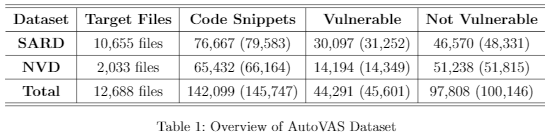

# Dataset

## SARD
- [Software Assurance Reference Dataset (SARD)](https://samate.nist.gov/SARD/)

The purpose of the Software Assurance Reference Dataset (SARD) is to provide users, researchers, and software security assurance tool developers with a set of known security flaws. This will allow end users to evaluate tools and tool developers to test their methods. These test cases are designs, source code, binaries, etc., i.e. from all the phases of the software life cycle. The dataset includes "wild" (production), "synthetic" (written to test or generated), and "academic" (from students) test cases. This database will also contain real software application with known bugs and vulnerabilities. The dataset intends to encompass a wide variety of possible vulnerabilities, languages, platforms, and compilers. The dataset is anticipated to become a large-scale effort, gathering test cases from many contributors. We have more information about the SARD, including goals, structure, test suite selection, etc.
## NVD
- [National Vulnerability Database (NVD)](https://nvd.nist.gov/)

The NVD is the U.S. government repository of standards based vulnerability management data represented using the Security Content Automation Protocol (SCAP). This data enables automation of vulnerability management, security measurement, and compliance. The NVD includes databases of security checklist references, security-related software flaws, misconfigurations, product names, and impact metrics.
## Directory
- source: original source code
- snippet: snippet files using by program slicing
- token: tokenizing result file that uses as an input data for embedding
